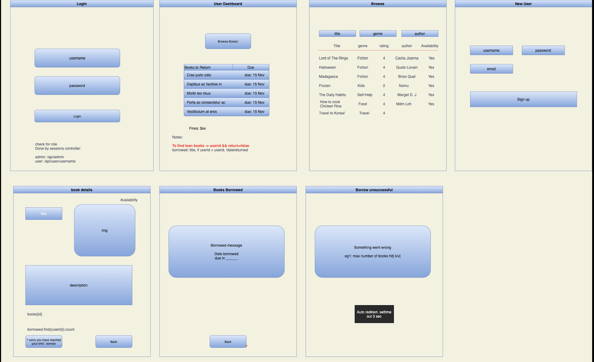
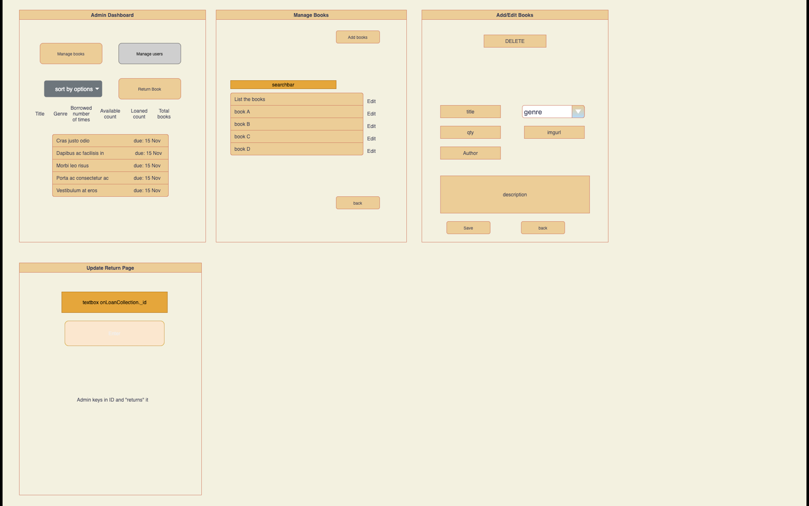

# Library Management System

## Table of contents

- [Introduction](#introduction)
- [Wireframe](#wireframe)
- [Technologies](#technologies)
- [Setup](#setup)
- [Important Resources](#important-resources)
- [Contributors](#contributors)

## Introduction

The objective of this project is to try to simulate the process of library book management system. From this project we will develop a reservation system that serve several functions,

General User:

- Create a new account for themselves
- Edit of individual account
- Reserve the book in the system

Adminstrator:

- Add new books
- Edit current books
- Handling of book returning

## Wireframe

How we will be planning to do the project and also include in all the different UX expereince flow, database set-up and all the different configuration

### User_Wireframe


The basic features of the wireframe emcopasses the abovementioned functionalities. The design concept for the user experience is simplicity where users can have a glance of all the books they have borrowed and yet to return. This serve as a subtle reminder to them on returning the book.

The subsequent pages allow users to browse through all the books that are available in the system with 3 different filtering functions (title, genre and author). During the checkout process, we have embeded an limiting function where users will not be able to check out any new books when they exceeded their borrowing limit of 5 books.

After books are check_out, a confirmation code will be presented to the users.

### Admin_Wireframe



The administration interface also focus on simplicity where admin personnel will be presented with important information such as books loans that should be returned back to the library. This would direct their attention to send reminders to the users.

The subsequent pages perform the following actions of adding new books in the library or update the current books.

The final function is to update the system when users returns their books and the library will be updated accordingly.

## Technologies

Project is created with:

- Mongodb
- Express
- React.js
- Node.js

Library used in the project:

- [ejs](https://www.npmjs.com/package/ejs)
- [nodemon](https://www.npmjs.com/package/nodemon)
- [mongoose](https://www.npmjs.com/package/mongoose)
- [bcrypt](https://www.npmjs.com/package/bcrypt)
- [material_UI](https://mui.com/)
- [axios](https://www.npmjs.com/package/axios)

## Setup

To run this project, install it locally using npm:

```
$ git clone
$ cd client && npm install
$ npm start
$ npm install
$ npm run dev
```

## Important Resources

Testing

## Contributors

---

Current:

- Junhao Tang
- Angeal Cheong
- Ethan Su
